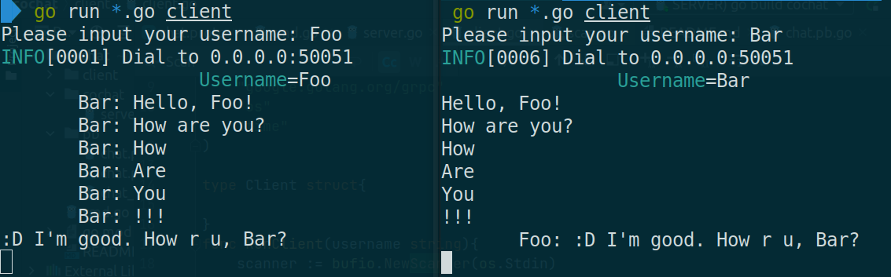

## Streaming Chat service using GRPC



**상상 속의 스트리밍 채팅 서비스** (유튜브 라이브 채팅 같은 걸 상상 중...)
* GRPC를 통한 서버 <---> 클라이언트 간의 양방향 통신
* Go 언어 특유의 강력한 동시성 지원을 활용
* Redis stream 및 Redis Pub/Sub을 바탕으로 한 서버간의 통신
* 복잡한 Join이 필요 없고 다량의 데이터를 리얼타임으로 저장해야하므로 No SQL DB 이용
* 채팅방 생성 및 각종 Create, Read 기능은 Java Spring의 MVC와 JPA로 튼튼하고 쉽게 개발
* 트래픽이 몰릴 경우를 대비해 채팅 이벤트는 Redis stream를 버퍼로 두고 워커가 영속화
* k8s + minikube를 이용해 로컬에서도 손쉽게 전체 인프라를 띄울 수 있도록 함.

## Protobuf

### 컴파일하는 방법

```text
$ protoc --go_out=. --go_opt=paths=source_relative \
    --go-grpc_out=. --go-grpc_opt=paths=source_relative \
    pb/chat.proto
```
